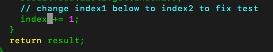
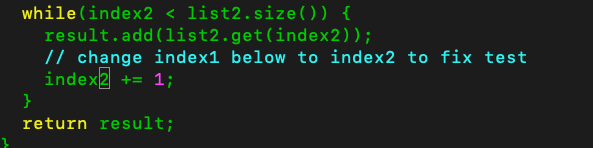

# Lab report 4

## Step 4: Logging into ieng6

From my local main directory, I typed the command `s s h <space> t n g u y e n t r o n g @ i e n g 6 . u c s d . e d u`, which logged me into the virtual machine ieng6 using the secret key we set up in previous labes.

## Step 5: clone forked lab7

From the main directory on ieng6, I typed the command `git clone https://github.com/thanhlongnt/lab7`, which then cloned all the files from my forked repo. 

## Step 6: running the tests

From the main directory on ieng6, I typed the command `cd lab7` which changed my directory to the repo that I just cloned. Then I typed `bash test.sh` to run the tests, which shows to fail.

## Step 7: Edit code file to fix failing tests

In the lab 7 directory, I typed the command `vim ListExamples.java`, which opens the file in vim editor. 

To fix the method, I first navigated down to the problem typing the vim command `43j` which brought my cursor down 43 lines.

I then moved my cursor to the left by pressing `h` 6 times

I then pressed the `x` key to remove the character `1` from `index1`.

I then pressed the `i` key to go into insert mode and pressed the key `2` to make the variable `index2`. Then I pressed `esc` to return back to normal mode

I then typed `:wq` to save and quit from the vim editor, which brought me back to the ieng6 main directory.

## Step 8: Running successful test

I pressed the `<up>` arrow once to retrieve the bash command that I used to run the first test. Then I pressed `<enter` to run the test, which displayed that all tests passed.

## Step 9: Commiting to forked repo

I typed the command `git add ListExamples.java` to add the file to the stage. Then I typed `git commit -m "ListExamples.java bug fixed` to commit the changes I made. 

